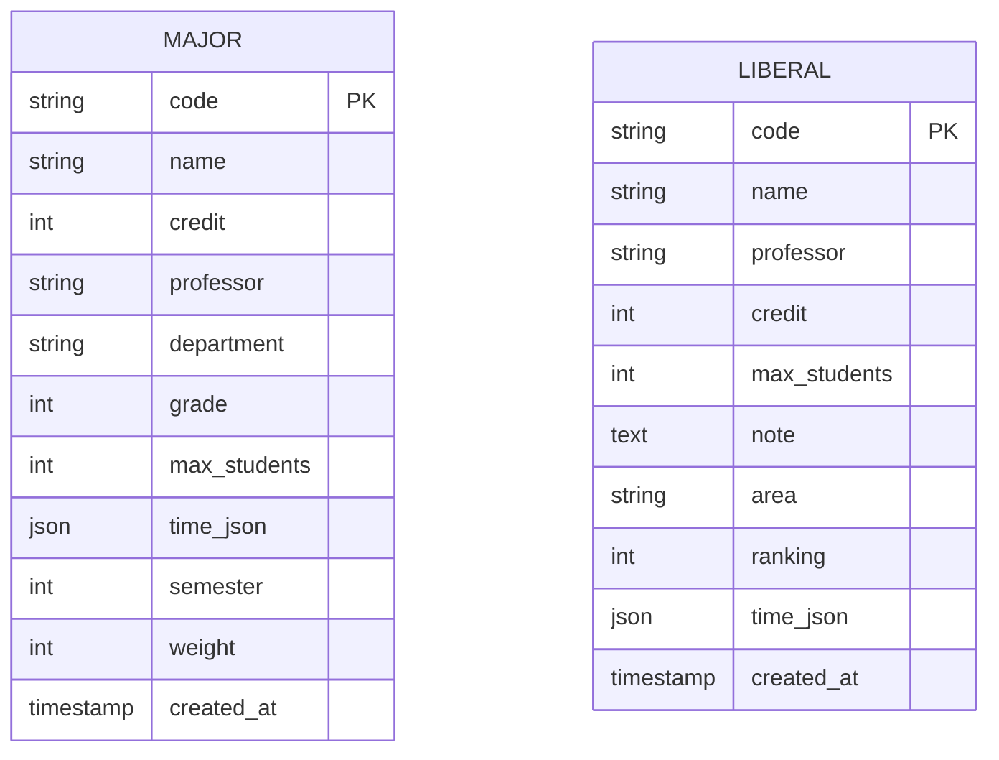

# 계명대학교 시간표 생성 시스템 - 백엔드

수강신청 마다 시간표를 맞추기 힘들어 하는 학생들을 위해 제작한 시간표 생성 시스템입니다
계명대학교 학생들의 시간표 작성을 돕기 위한 시간표 생성 및 대체 과목 추천 API 서버입니다.
시간 중복 방지, 교양 필수 영역 포함, 원격 강의 제한 등의 조건을 반영하여 최적의 시간표를 생성해 줍니다.

## 목차
- [기술 스택](#기술-스택)
- [실행 화면](#실행-화면)
- [데이터베이스 스키마](#데이터베이스-스키마)
- [API 문서](#api-문서)
- [주요 기능](#주요-기능)

## 기술 스택

- **런타임**: Node.js
- **프레임워크**: Express.js
- **데이터베이스**: MySQL
- **보안**: Helmet (보안 헤더 설정)
- **기타 라이브러리**:
  - dotenv: 환경변수 관리
  - cors: CORS 정책 처리
  - mysql2: MySQL 연결 및 쿼리

## 실행 화면

### 시간표 생성 화면

*학과, 학년, 학기별 맞춤형 시간표 생성 인터페이스*

### 대체 과목 추천 화면

*특정 과목을 대체할 수 있는 과목 추천 결과*

### 시간표 충돌 확인 화면

*선택한 과목 간 시간 중복 검사 결과*

### 원격 강의 선택 화면

*원격 강의 수 제한에 따른 과목 선택 인터페이스*

### 결과 시간표 화면

*최종 생성된 시간표 시각화*

## 데이터베이스 스키마

### 테이블 구조

#### 1. major 테이블 (전공 과목)
| 필드명 | 데이터 타입 | NULL 허용 | 키 | 기본값 | 설명 |
|--------|------------|-----------|-----|--------|------|
| code | varchar(20) | NO | PRI | | 과목 코드 (기본키) |
| name | varchar(100) | YES | | | 과목명 |
| credit | int | YES | | | 학점 |
| professor | varchar(50) | YES | | | 교수명 |
| department | varchar(100) | YES | | | 학과 |
| grade | int | YES | | | 학년 |
| max_students | int | YES | | | 최대 수강 인원 |
| time_json | json | YES | | | 수업 시간 정보 (JSON 형식) |
| semester | int | YES | | | 학기 |
| weight | int | YES | | 2 | 가중치 |
| created_at | timestamp | YES | | CURRENT_TIMESTAMP | 생성 시간 |

#### 2. liberal 테이블 (교양 과목)
| 필드명 | 데이터 타입 | NULL 허용 | 키 | 기본값 | 설명 |
|--------|------------|-----------|-----|--------|------|
| code | varchar(20) | NO | PRI | | 과목 코드 (기본키) |
| name | varchar(100) | YES | | | 과목명 |
| professor | varchar(50) | YES | | | 교수명 |
| credit | int | YES | | | 학점 |
| max_students | int | YES | | | 최대 수강 인원 |
| note | text | YES | | | 비고/설명 |
| area | varchar(50) | YES | | | 영역 (교양 분류) |
| ranking | int | YES | | | 순위/중요도 |
| time_json | json | YES | | | 수업 시간 정보 (JSON 형식) |
| created_at | timestamp | YES | | CURRENT_TIMESTAMP | 생성 시간 |

### ER 다이어그램



## API 문서

### 시간표 생성
- `POST /api/timetable` - 시간표 생성 요청
  ```json
  // 요청 본문 예시
  {
    "department": "컴퓨터공학과",
    "grade": 2,
    "semester": 1,
    "liberalAreas": ["인문", "사회"],
    "maxRemoteClasses": 2,
    "preferredProfessors": ["김교수", "이교수"]
  }
  ```

### 대체 과목 추천
- `GET /api/alternatives?code=CS101` - 특정 과목의 대체 과목 조회
- `POST /api/alternatives/recommend` - 전체 시간표에 대한 대체 시간표 추천
  ```json
  // 요청 본문 예시
  {
    "subjects": [
      {"code": "CS101", "name": "프로그래밍입문", "time_json": {...}},
      {"code": "CS201", "name": "자료구조", "time_json": {...}}
    ],
    "toReplace": "CS101"
  }
  ```

## 주요 기능

### 1. 시간표 생성 알고리즘
- 학과, 학년, 학기에 따른 전공 과목 필터링
- 교양 영역 및 온라인 강의 요건 반영
- 시간표 중복 방지 알고리즘 (timeValidator 활용)
- 교수 선호도 반영 가능

### 2. 대체 과목 추천 시스템
- 특정 과목을 대체할 수 있는 다른 과목 검색
- 전체 시간표를 고려한 최적의 대체 과목 추천
- 시간 충돌 없는 과목만 추천

### 3. 시간 검증 시스템
- JSON 형식의 시간 데이터를 파싱하여 중복 검사
- 원격 강의 수 제한 검증
- 요일 및 시간대별 충돌 여부 확인

### 4. 데이터 처리
- 전공 및 교양 과목 데이터 효율적 조회
- JSON 형태의 시간 정보 처리
- 조건에 따른 동적 쿼리 생성

### 5. 보안 및 에러 처리
- Helmet을 활용한 보안 헤더 설정
- 입력값 검증 및 예외 처리
- 에러 상황별 적절한 응답 제공

## 시스템 아키텍처

이 프로젝트는 MVC(Model-View-Controller) 패턴을 기반으로 설계되었습니다:

- **Controller**: 클라이언트 요청 처리 및 응답 반환
- **Service**: 핵심 비즈니스 로직 처리 (시간표 생성, 대체 과목 추천)
- **Util**: 공통 기능 및 유틸리티 함수 (시간 검증 등)
- **Routes**: API 엔드포인트 정의
- **Database Connection**: MySQL 데이터베이스 연결 관리
