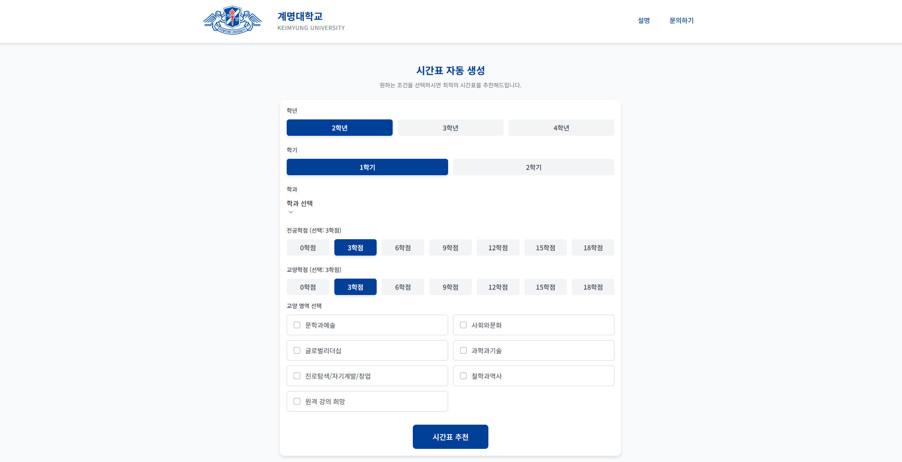
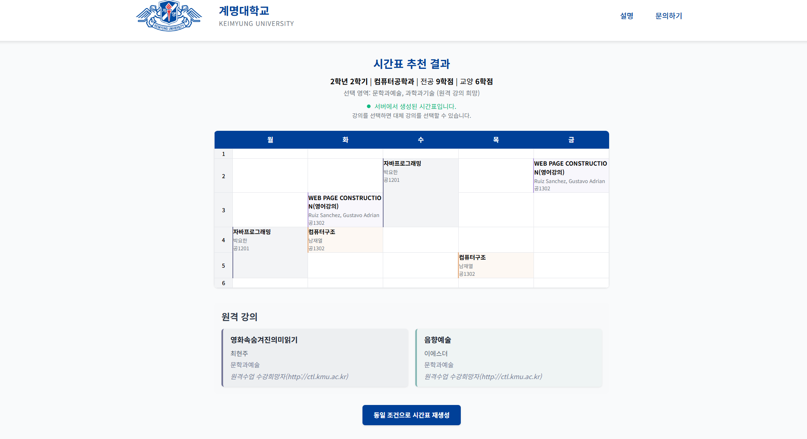
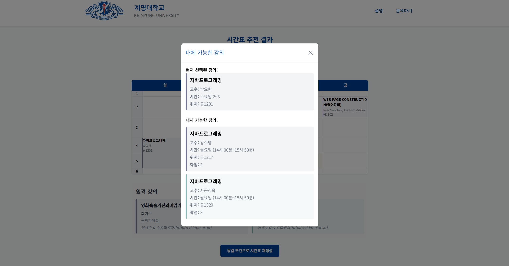

# 📚 KMU 시간표 자동생성 시스템

대학교에서 매 학기마다 **수강신청 전쟁**을 치르며 시간표를 짜는 게 너무 스트레스였습니다. 전공 필수과목은 시간이 겹치고, 교양은 뭘 들어야 할지 모르겠고, 원격강의는 몇 개까지 들을 수 있는지 헷갈리고... 이런 복잡한 조건들을 **자동으로 계산해서 최적의 시간표를 만들어주는** 시스템을 개발했습니다.

## 📱 화면 구성

<div align="center">

### 메인 화면 & 조건 설정

<br><br>

### 생성된 시간표



</div>

## 🚀 배포 환경
- **프론트엔드**: https://capstone-ochre-five.vercel.app
- **서버**: AWS EC2
- **데이터베이스**: MySQL

## 🌐 데모 체험
**↗️ [시간표 생성해보기](https://capstone-ochre-five.vercel.app)**

> 학과, 학년, 원하는 학점을 입력하면 자동으로 최적의 시간표를 생성해줍니다!

## 🛠 기술 스택
- **Backend**: Node.js, Express.js
- **Database**: MySQL
- **Deploy**: AWS EC2
- **Frontend**: React (별도 레포지토리)

---

## ✨ 핵심 기능

### 🤖 지능형 시간표 자동생성
- **전공/교양 학점 조건** 입력하면 자동으로 과목 선택
- **시간 겹침 자동 방지** - 물리적으로 불가능한 시간표 차단
- **원격강의 제한** - 최대 2개까지만 자동 배치
- **가중치 기반 선택** - 중요한 전공과목, 인기 교양과목 우선 배치

### 🔄 스마트 대체과목 추천
- **문제 과목 감지** - 시간이 겹치는 과목 자동 찾기
- **동일 조건 대체과목** - 같은 시간대, 같은 과목명으로 다른 분반 추천
- **차선책 추천** - 대체 불가능한 경우 다음 순위 과목으로 교체 제안

### 📊 실시간 검증 시스템
- **학점 계산** - 요청 학점 vs 실제 배치 학점 비교
- **제약조건 체크** - 원격강의 개수, 시간 중복 실시간 검증
- **성공률 표시** - 원하는 조건 달성 여부 즉시 확인

---

## 🎯 문제 해결 포인트

### ✅ 기존 문제점
- 수강신청 사이트에서 하나씩 시간 확인하며 수동으로 짜야 함
- 전공과 교양 학점 배분 계산이 복잡함
- 원격강의 제한 규정을 놓치기 쉬움
- 좋은 교양과목을 찾기 어려움

### 💡 해결 방법
- **조건 입력만으로 완성된 시간표 자동 생성**
- **복잡한 대학 규정을 시스템에 내장**
- **과목 인기도와 중요도 데이터 기반 추천**
- **실시간 검증으로 불가능한 조합 사전 차단**

---

## 💻 핵심 알고리즘

### 1. 시간 겹침 검증
여러 과목의 시간표를 동시에 검사하여 물리적 충돌 방지

```javascript
// utils/timeValidator.js - canAddSubject()
function canAddSubject(newSubject, selectedSubjects) {
    // 원격 강의 개수 제한 검사
    if (isNewSubjectOnline) {
        const onlineCount = countOnlineCourses(selectedSubjects);
        if (onlineCount >= 2) return false;
    }
    
    // 기존 과목들과 시간 겹침 검사
    for (const subject of selectedSubjects) {
        if (isSubjectsOverlap(newSubject, subject)) {
            return false;
        }
    }
    return true;
}
```

### 2. 가중치 기반 과목 선택
전공은 중요도(weight), 교양은 학생 선호도(ranking) 순으로 우선배치

```javascript
// services/timetableService.js - getMajorSubjects()
const [rows] = await pool.query(
    'SELECT * FROM major WHERE department = ? AND grade = ? AND semester = ? ORDER BY weight DESC',
    [department, grade, semester]
);

// 교양은 인기 순위로 정렬
query += ' ORDER BY ranking ASC';
```

### 3. 지능형 대체과목 추천
현재 시간표에서 문제가 되는 과목을 자동으로 감지하고 더 나은 대안 제시

```javascript
// services/subjectAlternativeService.js - recommendAlternativeTimetable()
for (const liberal of offlineLiberalSubjects) {
    const nextRankedLiberals = await this.getNextRankedLiberals(liberal);
    
    // 다음 순위 과목들 중 시간이 안 겹치는 첫 번째 과목 선택
    for (const alt of nextRankedLiberals) {
        if (this.isValidReplacement(alt, result)) {
            result.offline.liberal.push(alt);
            break;
        }
    }
}
```

---

## 📈 개발 성과

### 🎯 핵심 장점
- **완전 자동화**: 조건 입력 5분 → 완성된 시간표 즉시 생성
- **최적화 알고리즘**: 수천 개 과목 조합에서 최선의 선택 자동 계산
- **사용자 친화적**: 복잡한 조건을 간단한 폼으로 입력

### 📚 습득 기술
- **복잡한 비즈니스 로직 구현**: 대학 수강규정의 다양한 제약조건 시스템화
- **알고리즘 최적화**: 조합 최적화 문제를 효율적으로 해결
- **대용량 데이터 처리**: 수천 개 과목 데이터의 실시간 검색/필터링
- **JSON 데이터 활용**: MySQL JSON 타입을 활용한 복잡한 시간 데이터 처리

### 🔧 기술적 도전
- **시간복잡도 최적화**: 모든 과목 조합을 검사하는 알고리즘의 성능 개선
- **데이터베이스 설계**: 전공/교양 과목의 서로 다른 속성을 효율적으로 관리
- **예외상황 처리**: 원하는 조건을 만족하는 시간표가 없을 때의 대안 제시

---

## 🗂 데이터 수집 및 전처리

### 📥 원본 데이터 문제점
학교 홈페이지에서 다운받은 CSV 파일의 수업 시간 데이터가 완전히 제각각이었습니다:

```
❌ 비정형 데이터 예시
- "월1,2,3교시" 
- "화 09:00~12:00"
- "수요일 13:30-15:00"
- "목(14:00-16:30)"
- "금 2-4교시"
- "원격수업"
```

### 🔧 Node.js 파싱 시스템 구축
수천 개 과목의 시간 데이터를 일관된 JSON 형태로 변환하는 파싱 엔진 개발:

```javascript
// 예상 파싱 로직 (시간 형식 통일화)
function parseTimeData(rawTimeString) {
    // 다양한 패턴 매칭으로 시간 추출
    const patterns = [
        /([월화수목금토일])\s*(\d{1,2}):(\d{2})~(\d{1,2}):(\d{2})/,
        /([월화수목금토일])\s*(\d{1,2}),(\d{1,2}),(\d{1,2})교시/,
        /([월화수목금토일])\s*(\d{1,2})-(\d{1,2})교시/
    ];
    
    // 결과: { day: "월", start: "09:00", end: "12:00" }
    return standardizedFormat;
}
```

### 📊 데이터 처리 성과
- **처리 과목 수**: 전체 학과 수천 개 과목 데이터
- **정규화 완료**: 시간 형식 100% 통일 (JSON 구조)
- **품질 향상**: 비정형 텍스트 → 검색 가능한 구조화 데이터
- **자동화**: 매 학기 새 데이터도 동일한 파서로 처리 가능

이 과정에서 **정규표현식, 문자열 처리, 대량 데이터 변환** 등의 실무 데이터 처리 스킬을 습득했습니다.

---

### 💡 추후 개선 계획
- 개인별 선호도 학습 기능 (수강했던 과목 패턴 분석)
- 실시간 수강신청 연동 (좌석 현황 반영)
- 친구들과 공통 시간표 생성 기능